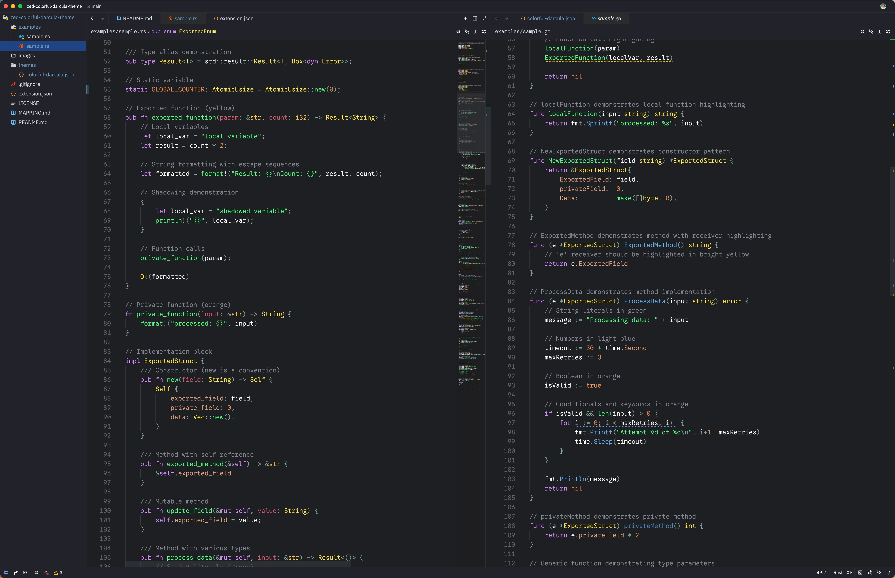

# Colorful Darcula for Zed

A vibrant dark theme for Zed editor, ported from GoLand/RustRover's Colorful Darcula color scheme. This theme is specifically optimized for **Go** and **Rust** development with rich semantic highlighting.

## Features

- 🎨 Rich, colorful syntax highlighting
- 🌙 Dark theme based on JetBrains Darcula
- 🦀 Optimized for Rust development
- 🐹 Optimized for Go development
- 👁️ Carefully selected colors for better code readability
- ✅ Fully validated against Zed's official theme schema v0.1.0
- 🎯 Enhanced tab visibility for multi-tab workflows

## Screenshots



## Installation

### From Source

1. Clone this repository:
   ```bash
   git clone <repository-url>
   ```

2. Create the Zed extensions directory if it doesn't exist:
   ```bash
   mkdir -p ~/.config/zed/extensions
   ```

3. Copy or symlink the theme to Zed's extensions directory:
   ```bash
   ln -s /path/to/zed-colorful-darcula-theme ~/.config/zed/extensions/colorful-darcula
   ```

4. Restart Zed or reload the window

5. Open Zed settings (Cmd+, on macOS, Ctrl+, on Linux/Windows)

6. Select "Colorful Darcula" from the theme picker

### Alternative: Manual Installation

1. Copy the entire `zed-colorful-darcula-theme` directory to `~/.config/zed/extensions/`
2. Restart Zed
3. Select the theme in settings

## Color Palette

### Go Language Specific

| Element | Color | Hex |
|---------|-------|-----|
| Exported Functions | Yellow | `#ffe37b` |
| Local Functions | Orange | `#ff7b00` |
| Method Receivers | Bright Yellow | `#ffff00` |
| Function Parameters | Purple | `#9077c6` |
| Local Variables | Blue | `#6598c6` |
| Exported Structs | Brown | `#c67f58` |
| Exported Interfaces | Tan | `#c6a469` |
| Local Structs | Gray-Blue | `#8996a5` |
| Local Interfaces | Steel Blue | `#7d91c6` |
| Exported Struct Fields | Lime Green | `#5bc600` |
| Exported Constants | Purple | `#9876aa` |
| Package Local Constants | Light Purple | `#be93d0` |
| Package Variables | Purple | `#9077c6` |
| Shadowing Variables | Cyan | `#2ce7ac` |
| Type Specifications | Sea Green | `#51c688` |

### General Syntax

| Element | Color | Hex |
|---------|-------|-----|
| Comments | Gray | `#7f848e` |
| Strings | Green | `#50fa7b` |
| Keywords | Purple | `#d689ff` |
| Numbers | Orange | `#e4854e` |
| Booleans | Orange | `#f79256` |
| Functions | Yellow | `#ffe66d` |
| Methods | Blue | `#61afef` |
| Types | Green | `#50fa7b` |
| Type Builtins | Yellow | `#d6c05f` |
| Variables | White | `#ffffff` |
| Variable Parameters | Red | `#d1556c` |
| Variable Members | Orange | `#dfa180` |
| Variable Special | Purple | `#d689ff` |
| Constants | Orange | `#e4854e` |
| Properties | Orange | `#dfa180` |
| Enums | Yellow | `#d6c05f` |
| Constructors | Blue | `#8ba2d3` |
| Operators | Blue-Gray | `#83a598` |
| Attributes/Macros | Blue-Gray | `#83a598` |
| Labels | Red | `#e06c75` |
| Tags | Red | `#e06c75` |

### UI Colors

| Element | Color | Hex |
|---------|-------|-----|
| Background | Dark Gray | `#2b2d30` |
| Editor Background | Darker Gray | `#1e1f22` |
| Editor Active Line | Subtle Gray | `#25262a` |
| Tab Bar Background | Dark Gray | `#22232a` |
| Tab Inactive | Dark Gray | `#22232a` |
| Tab Active | Medium Gray | `#3a3c41` |
| Panel Background | Dark Gray | `#22232a` |
| Selection | Dark Blue | `#214283` |
| Border | Dark Gray | `#2b2d30` |
| Border Variant | Medium Gray | `#3a3c41` |
| Border Focus | Blue | `#3e6185` |
| Element Hover | Medium Gray | `#3a3c41` |
| Element Active | Blue | `#4b6eaf` |

## Schema Compliance

This theme is fully validated against [Zed's official theme schema v0.1.0](https://zed.dev/schema/themes/v0.1.0.json). All color properties and configurations strictly follow the specification, ensuring compatibility and stability.

## Language Support

While this theme works with all languages supported by Zed, it's particularly well-suited for:

- **Go** - Full semantic highlighting with distinction between exported/local symbols
- **Rust** - Rich syntax highlighting for structs, traits, enums, and macros
- **JavaScript/TypeScript** - Clear distinction between different code elements
- **Python** - Good contrast for classes, functions, and variables
- **C/C++** - Proper highlighting for types and functions

## Customization

To customize the theme, edit `themes/colorful-darcula.json` and modify the color values. The theme follows Zed's theme schema v0.1.0.

### Key Sections

- `style.syntax.*` - Syntax highlighting colors
- `style.editor.*` - Editor-specific UI colors
- `style.element.*` - General UI element colors
- `style.text.*` - Text colors for UI elements

## Inspiration

This theme is based on the "Colorful Darcula" scheme from JetBrains IDEs (GoLand/RustRover), adapted for Zed's theme system with special attention to Go and Rust syntax highlighting.

## Contributing

Contributions are welcome! If you find colors that don't work well or have suggestions for improvements:

1. Fork the repository
2. Make your changes
3. Submit a pull request

## License

MIT License - See LICENSE file for details
